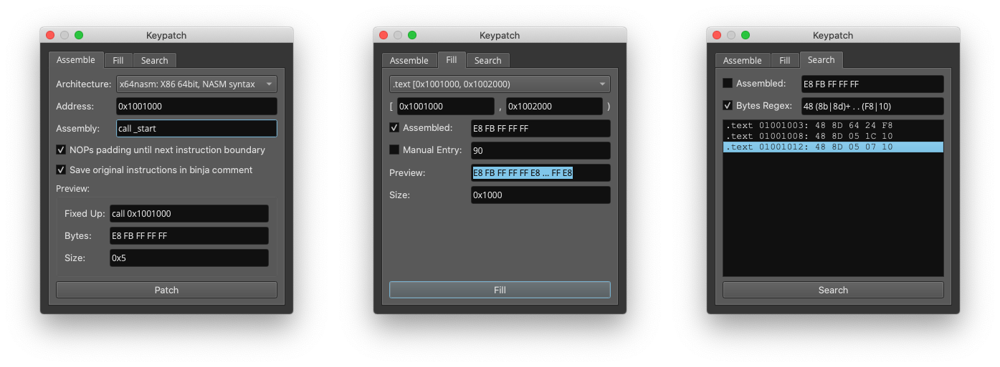

Remake of [keypatch](https://github.com/keystone-engine/keypatch) plugin for Binary Ninja.

Python != 3.10 is needed on arm64 macs to avoid install issues with keystone-engine.

* assemble using [keystone](https://www.keystone-engine.org/)
* fill areas with instructions or arbitrary bytes
* search for instructions or bytes, with regular expressions

The plugin manager only installs and updates at release boundaries. If you want the hottest freshest code, navigate to your [plugins folder](https://docs.binary.ninja/guide/plugins.html) and clone this repo to get started, pull to update.

## Developer Notes

https://docs.binary.ninja/dev/plugins.html

Tests that must pass before PR considered, release made, etc.

* file -> new binary data -> 1f 20 03 d5 1f 20 03 d5 1f 20 03 d5 1f 20 03 d5, create aarch64 function, now use keypatch to assemble at 0, 4, 8, and C the instruction `bl 0x1000`
* fill from [0x4, 0xc) with manually entered bytes AA AA AA AA and get two `orn x10, x21, x10, asr #0x2a`
* now fill from [0x4, 0xc) with assembled `nop`
* now search for `1f .*? d5` and it shoudl hit at every nop
