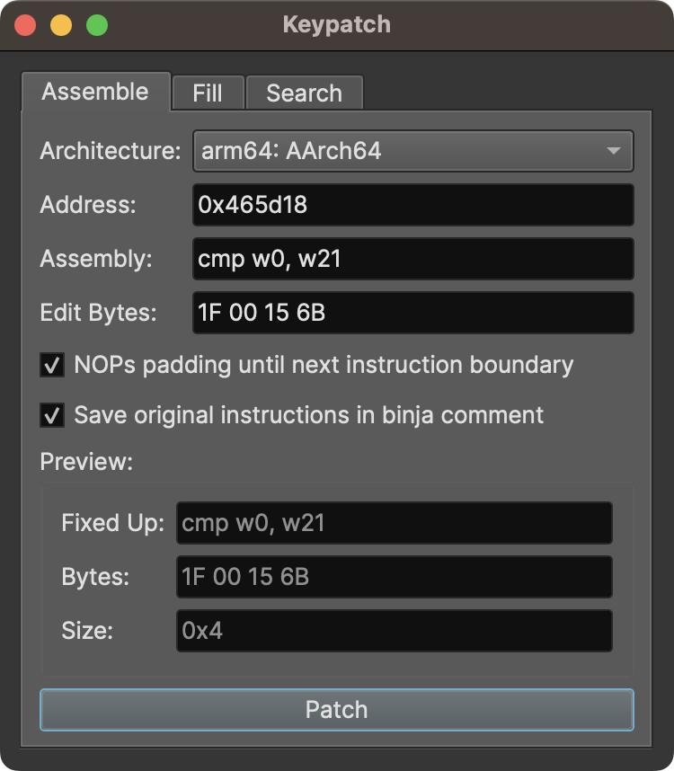
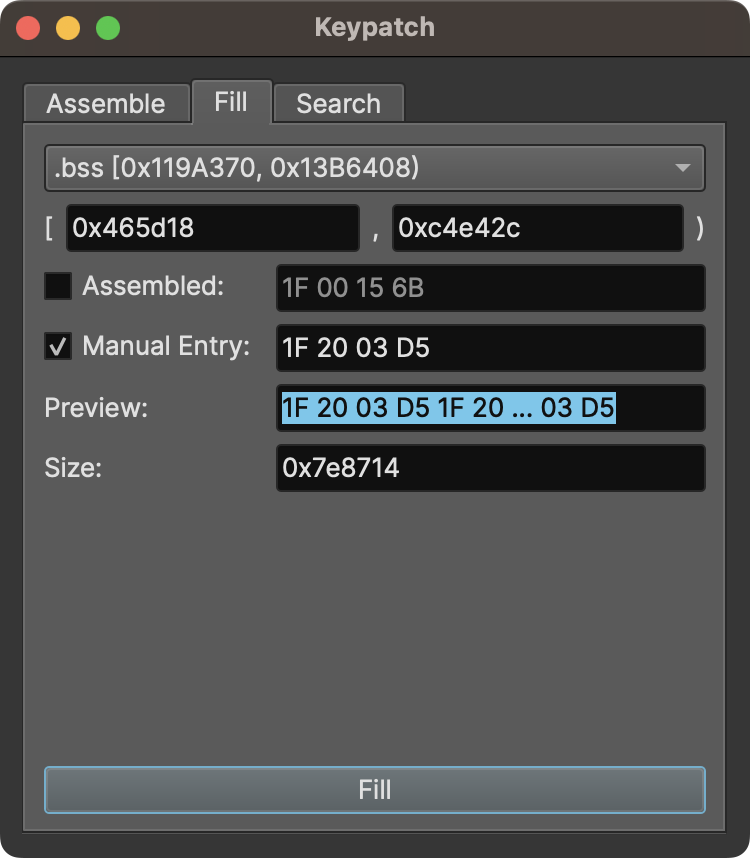
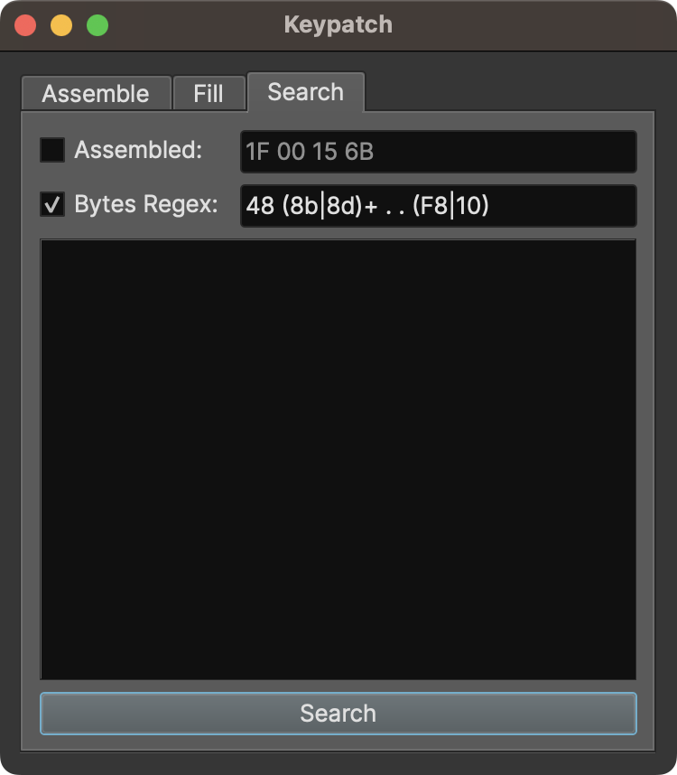

Remake of [keypatch](https://github.com/keystone-engine/keypatch) plugin for Binary Ninja.

* assemble using [keystone](https://www.keystone-engine.org/)
* directly modify the bytes of insn
* fill areas with instructions or arbitrary bytes
* search for instructions or bytes, with regular expressions

The plugin manager only installs and updates at release boundaries. If you want the hottest freshest code, navigate to your [plugins folder](https://docs.binary.ninja/guide/plugins.html) and clone this repo to get started, pull to update.
